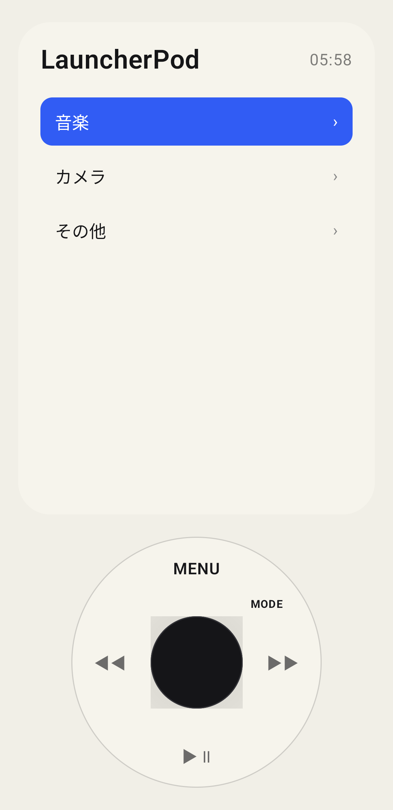
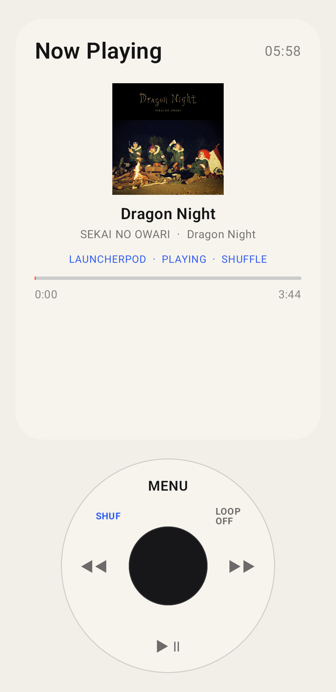
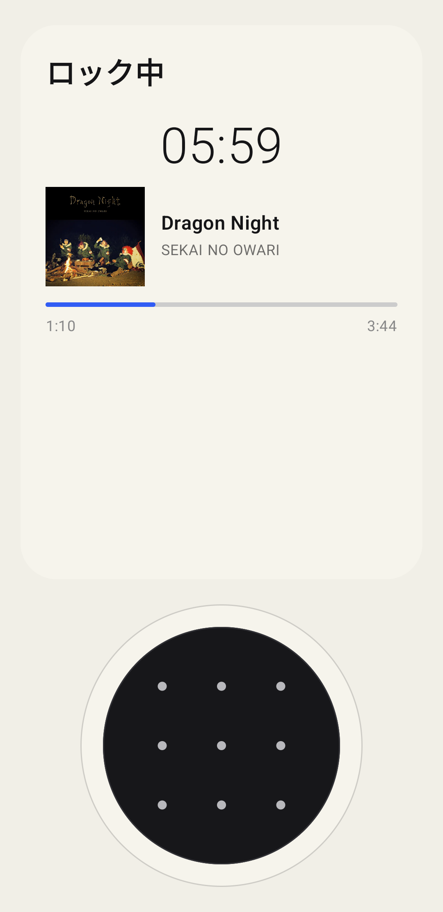

# LauncherPod

LauncherPodは、iPodのクリックホイールに着想を得たAndroidランチャー兼ローカル音楽プレイヤーです。端末内の音楽、インストール済みアプリ、SpotifyやYouTube Musicなどの外部再生情報を、シンプルな画面から操作できます。

> [!WARNING]
> LauncherPodのロックはランチャー内の「疑似ロック」です。Android OSのロック画面や暗号化を置き換えるものではなく、端末やデータの安全性を保証しません。実際の保護にはAndroid標準のPIN、パターン、パスワード、生体認証を併用してください。

## 主な機能

- Androidのデフォルトホームアプリとして動作
- タッチ操作対応のクリックホイールUI
- 端末内の曲、アルバム、アーティスト、プレイリスト表示
- シャッフル、全曲リピート、1曲リピート
- 画面消灯中・他アプリ使用中のバックグラウンド再生
- Spotifyなど外部音楽アプリの曲名、アーティスト、ジャケット、再生位置の表示と操作
- ホームメニューとiPod風Now Playing画面の切り替え
- 画面内のパターン操作によるiPod風疑似ロック
- 本体色、画面色、ホイール色、サイズ、文字サイズのカスタマイズ
- ホームに表示するアプリの選択

## スクリーンショット

| ホーム | Now Playing | 疑似ロック |
| --- | --- | --- |
|  |  |  |

## 対応環境

- Android 10（API 29）以降
- 動作確認済み実機: Google Pixel 3a
- 720×1280、1080×2088、1440×3200相当の表示サイズを確認

Pixel以外の実機は未検証です。メーカー独自の省電力機能やホームアプリ設定により、動作が異なる場合があります。

## APKからインストール

1. [Releases](../../releases)から最新のAPKをダウンロードします。
2. Androidで、ダウンロードに使用したアプリへ「不明なアプリのインストール」を許可します。
3. APKを開いてインストールします。
4. 初回セットアップでLauncherPodをデフォルトのホームアプリに設定します。
5. 端末内の音楽を使う場合は、音楽アクセスを許可します。
6. 外部アプリの再生情報を使う場合は、通知へのアクセス設定で `LauncherPod Music Access` を許可します。

パッケージ名は `dev.maulu.launcherpod`、現在のバージョンは `1.0.2` です。

## ソースからビルド

1. Android Studioでこのプロジェクトを開きます。
2. Android SDK 36とJDK 17を用意します。
3. Gradle Syncを実行します。
4. Android StudioのRun、または `gradlew assembleDebug` を実行します。

## Pixel Launcherへ戻す方法

Android設定から次の順に開き、Pixel Launcherを選びます。

`設定 → アプリ → デフォルトのアプリ → ホームアプリ → Pixel Launcher`

ADBを利用できる場合:

```shell
adb shell cmd package clear-preferred-activities dev.maulu.launcherpod
adb shell cmd role remove-role-holder android.app.role.HOME dev.maulu.launcherpod 0
adb shell cmd role add-role-holder android.app.role.HOME com.google.android.apps.nexuslauncher 0
```

Androidのバージョンによって最後のコマンドが使えない場合は、最初の2行を実行後、ホームボタンを押してPixel Launcherを選択してください。

## 権限とプライバシー

- 音楽アクセス: 端末内の音楽一覧と再生に使用
- 通知へのアクセス: 外部音楽アプリのMediaSession情報の取得に使用
- フォアグラウンドサービス: バックグラウンド音楽再生の継続に使用

LauncherPodは、取得した音楽情報やアプリ一覧を外部サーバーへ送信しません。

## 既知の制限

- 疑似ロックは通知、設定、別ランチャー、ADBなどから回避できます。
- DRM保護されたストリーミング音源そのものは取得せず、外部アプリの再生情報と操作だけを扱います。
- 一部の音楽アプリはMediaSession情報や操作を公開しない場合があります。
- メーカー独自Androidでは、バックグラウンド再生に追加の省電力除外設定が必要な場合があります。

## License

[MIT License](LICENSE)
